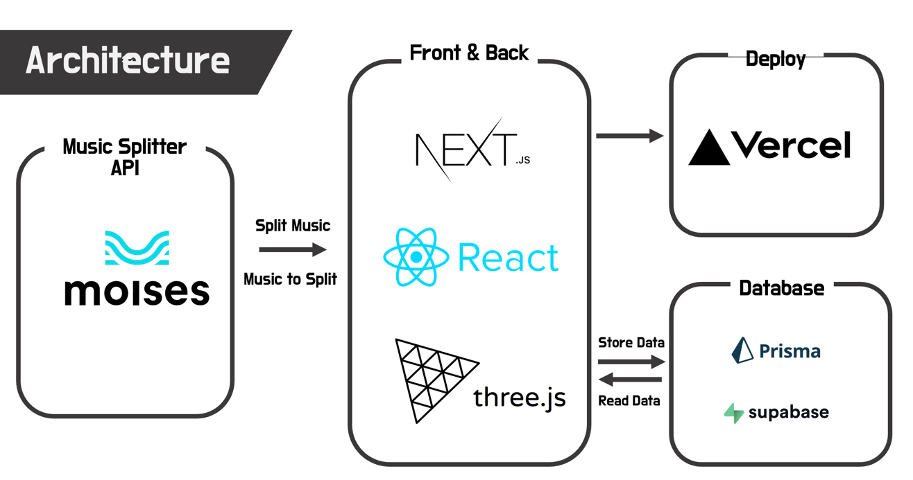

## Music visualizer

### 1. Description

* `Music visualizer`는 music splitter를 이용하여 사용자가 원하는 음원을 보컬, 피아노, 기타, 드럼, 베이스 별로 분리하여 각 트랙을
  개별적으로 시각화하여 보여주는 서비스입니다.

* Web 3D 기술을 이용하여 분리된 트랙을 3D object로 시각화하고, 음원과 동기화된 3d animation을 제공합니다.

* 사용자가 원하는 무대배경, 악기 디자인을 선택하고 위치를 조정하여 자신만의 무대를 만들 수 있습니다.

### 2. Architecture

